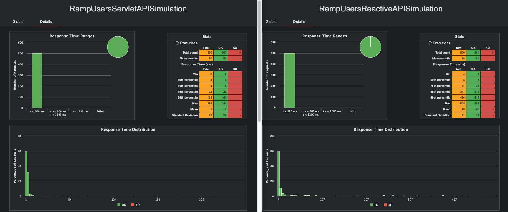
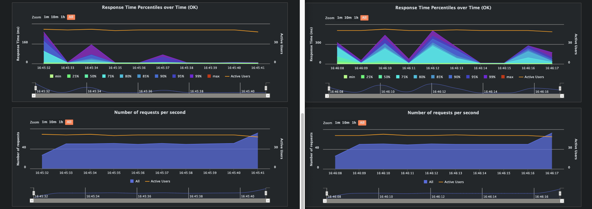
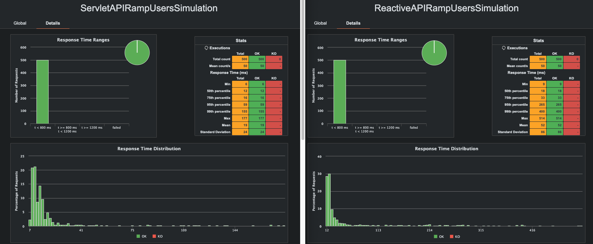
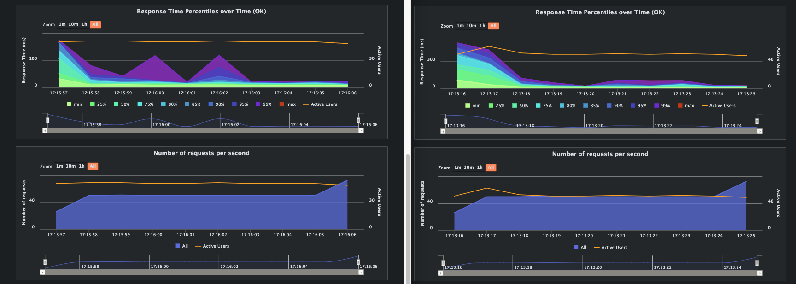
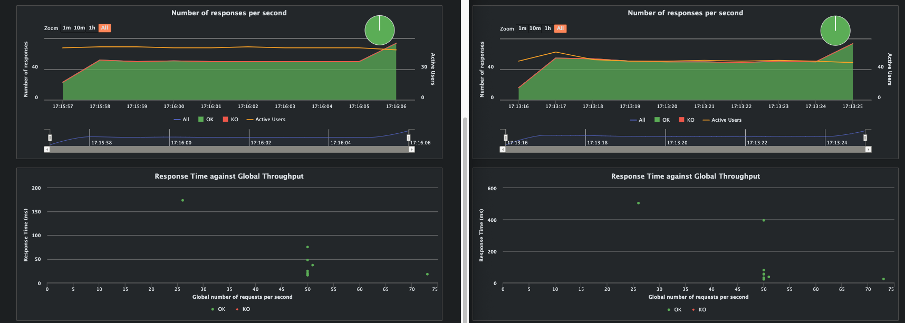

# Spring Reactive VS Servlet

## Introduction

While studying Java and Spring Boot, I came across [Giovana's project](https://github.com/giuliana-bezerra/spring-reactive) in which she compares the two Spring stacks: [Servlet and Reactive](https://spring.io/reactive).

I thought it would be a good idea to try doing the same on my own with a few changes.

## Implementation

Both APIs are vey similar and have two endpoints: one for saving a book and another one for listing books.
The data is saved in a PostgreSQL database.

### Servlet vs Reactive stack

| Servlet                         | Reactive                                  |
|---------------------------------|-------------------------------------------|
| Spring MVC                      | Spring WebFlux                            | 
| Spring Data Repositories - JDBC | Spring Data Reactive Repositories - R2DBC |
| H2 Database for Testing         | R2DBC H2 for Testing                      |
| TestRestTemplate for Testing    | WebTestClient for Testing                 |

## Running the applications

The following command starts both APIs and the PostgreSQL database.
```shell
docker-compose up --build -d
```

Port:
- 8080 - servlet-api
- 8181 - reactive-api
## Load Test

For the load test, I'm using [Gatling with Java](https://docs.gatling.io/tutorials/scripting-intro/).

```shell
cd gatling-load-tests
mvn gatling:test
```

### Ramp User Simulation - Locally

- Gatling starts 500 virtual users over 10 seconds.
- Each user sends a GET request to /books.





### Ramp User Simulation - Docker

After setting up Docker and Docker Compose, I re-ran the ramp-user test just for sake of curiosity.

- Gatling starts 500 virtual users over 10 seconds.
- Each user sends a GET request to /books.






